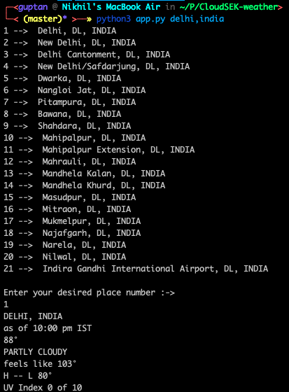
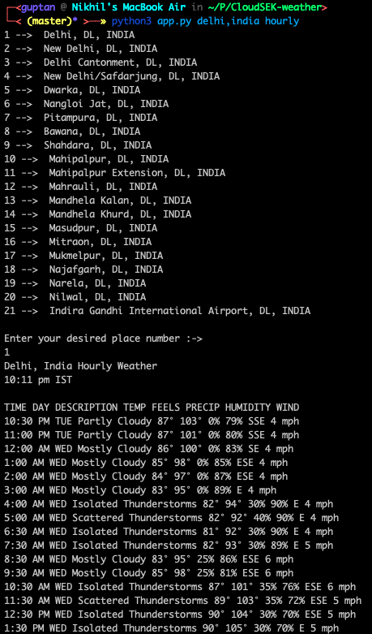
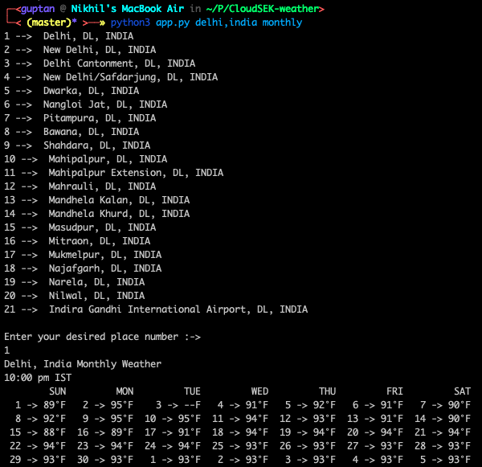
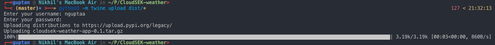

# CloudSEK-weather

This repo contains a weather web crawling application fulfilling all the essentials mentioned in the task.

## Getting Started

First download the whole repository into your PC. Then all you need is to run the python program **app.py** , along with the argv as place, time and type of forecast. Example:- **python app.py Delhi,India daily/hourly/monthly**

### Prerequisites

First you should have [Python 3](https://docs.python.org/3.0/) installed in your PC. If it's not installed one can easily install it through following links:

* [Installing Python 3 on Mac OS X](https://docs.python-guide.org/starting/install3/osx/)
* [Installing Python 3 on Linux](https://docs.python-guide.org/starting/install3/linux/)
* [Installing Python 3 on Windows](https://docs.python-guide.org/starting/install3/win/)


### Installing

After installing python 3 we need to again install all the necessary dependencies in order to run the script.

It's always recommended to use [Virtual Environment(virtualenv)](https://packaging.python.org/guides/installing-using-pip-and-virtualenv/) before installing dependencies as virtualenv allows you to manage separate package installations for different projects. It essentially allows you to create a “virtual” isolated Python installation and install packages into that virtual installation. One can easily install, create and activate virtualenv by following the link mentioned below :

* [Virtual Environment(virtualenv)](https://packaging.python.org/guides/installing-using-pip-and-virtualenv/)

After that you can install 'requirements.txt' as it contains all the necessary dependencies you need to run the script. To install all the dependencies at once you just need to install pip and run the following command:

```
pip3 install requirements.txt or python3 -m pip install requirements.txt
```

**Also add the chromedriver attach in the repo into your $PATH**

## Sample Input

```
python3 app.py delhi,india monthly
```

## Image below show the sample output received by running app.py

###Daily Output


###Hourly Output**


###Monthly Output**


###Package upload code to PYPI**



## Authors

* **[Nikhil Gupta](https://github.com/nguptaa)**

## License

This project is licensed under the MIT License - see the [LICENSE.md](LICENSE.md) file for details.
